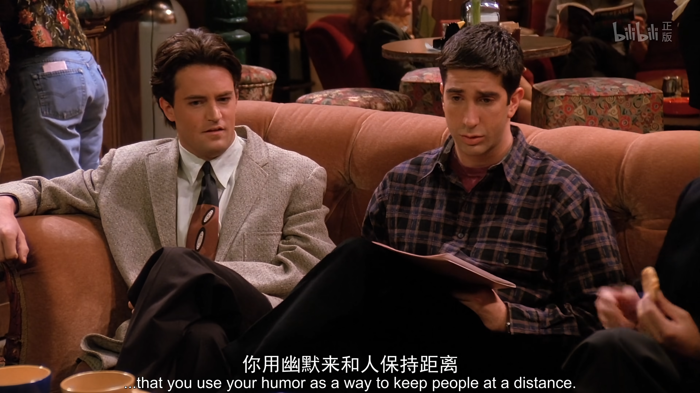
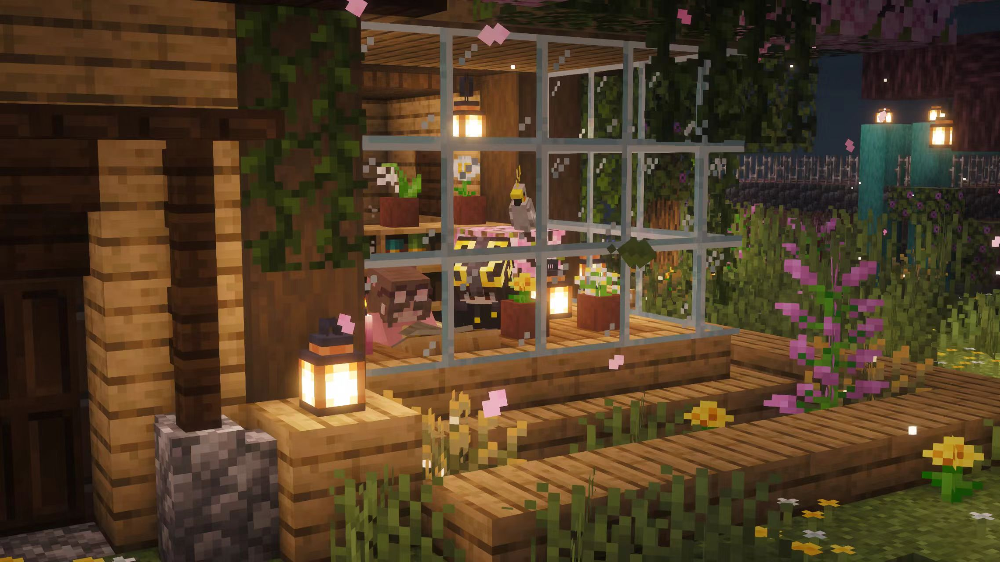

我感到很孤独

在我小的时候，妈妈就这样告诉我：
> 多出去走走，交点朋友，和他们一起玩，这样你就不会觉得孤独了。

但不论从任何方面，我都感到很孤独。我是真真切切感觉，我漂浮在一作空岛上。我自己最感兴趣的一些事情，没有人能和我一起做。

### Friends

我这样做了，我这样做了很多年，我为了能够和朋友们在一起，不显得不合群，我在2023年之后甚至搞起了抽象；但只有我自己知道，那不是真的我。

我就像 Chandler Bing 那样，他的人设里，他会用幽默来作为自己的防御机制。我自己并不幽默，我只是用那些搞抽象的话术，来作为自己和他人贴近的工具手段

我从小到大，我感觉，我一直没有一个那样的，特别知心的朋友。
我没有在说我身边的任何一个朋友不好，他们都是特别好的伙伴，我和他们相处在一起的时候也很开心。

但是……

- 没有人能和我一起去携手，做一个 Github 开源项目。
- 没有人能和我一起去玩 Minecraft ，一起在游戏里去做一些事情，或者什么都不做。
- 没有人能和我一起玩守望先锋，我们双排一起语音，一起配合或是互坑。
- ……

没有。我寻觅了如此之久，我从未寻觅到这样一个朋友。

### Love

自从放下 ta 之后，我也开始往前走了；

但是，可能是各种原因吧，我不敢亲近任何一个我有好感的人。**失去的恐惧**远远超过了**得到的幸福**。
那一次失去给我的打击太大了，我花了快5年才放下这些东西。我不说如果表白失败，朋友能不能做成，即使在一起了，那么如果后面又分开呢？我这次又得花多少年？

我一直标榜自己 fearless ，但在这个问题上我在永远地后退。

我甚至感觉自己已经到了一个病态的地步；我在告诉自己：
> 找下对象，自己的 freedom 就要失去一部分，你为什么要让渡自己的 freedom 呢？

挺神人的想法，但人在安慰自己的时候就是会这样；不敢向前，那就得给自己一个退后的理由吧。

### 亲情

我感觉自己没有家

当然，我没有和父母闹掰，我在太原还有一个家。我有爱我的父亲和母亲，我也爱他们；他们没有做错任何事，我也不抱怨他们任何一个人没让我成为富二代官二代。

但我的父亲是一个典型的中国式父亲：他就是做的典型的打压式教育。即使我现在，每个月读研还是要和家里要生活费，他还能说出：“下个月给你断供了，自己养活自己吧。”
我也能理解，人都是当局者迷旁观者清；他可能自己也没有意识到自己做的这些事，说的这些话就是让我们这一代反感的话。

可是，爱不是常觉亏欠吗？
即使我的父亲是第一次做父亲，但那也不能代表，我必须也得原谅他对我的精神压迫。
虽然出现的情况不算多，但每一次出现，我都得感觉不舒服。我也没有理由必须牺牲我自己的精神状态来适应他吧。

我的母亲从21年之后再没有回家过年，一年见面时间不超过三次，三次还是最多的情况。

我没有一个温馨的家。

### I live alone, but I don't feel lonely

这句话，是我最开始学 `alone` 和 `lonely` 时，当时的补课 `Ms·Han` 教给我的，我记了这么久。

孤独的感觉，越长大越明显。

可是，这是我的错吗？是我没有融入主流吗？是我不主动的错吗？

我想不明白，我只知道我自己的灵魂在我内心里的白色宫殿里，住的很舒服。我在无限制地让自己开心，物质方面。但，我永远还是：

### Lonely

还记得我开头那句话吗？

> 多出去走走，交点朋友，和他们一起玩，这样你就不会觉得孤独了。

猜猜这是在什么时候，母亲和我说的？

是的，我当时在拿着我自己的玩具，我在自己和自己玩；我在扮演另一个我想象中的知心朋友。我那时才7岁。
我当时就在想，为什么世界上没有一个完全和我想法相同的朋友，我只想和我这个理想中的朋友玩。

我那时候也知道这个想法是很天真的，我甚至知道那个时候就知道这是天真的。我也没有因此就放弃一切友情，相反我和任何一个阶段的同学都相处的特别好，因为我也知道这个理想的朋友不好寻觅，我需要接受人和人的不同。

但随着年纪越来越大，我对我周围一切一切理解越来越深刻了。

所以

  <h1
    style="
      font-family: 'Georgia', 'Times New Roman', serif;
      font-weight: 300;
      font-style: italic;
      letter-spacing: 0.24em;
      font-size: 3.4em;
      margin: 30px 0;
      background: linear-gradient(
        110deg,
        #f1f3f8 10%,
        #aeb9d6 45%,
        #7684a9 70%,
        #d9deea 100%
      );
      -webkit-background-clip: text;
      background-clip: text;
      color: transparent;
      text-shadow:
        0 0 24px rgba(150, 165, 210, 0.15);
    "
  >
    I feel lonely.
  </h1>

